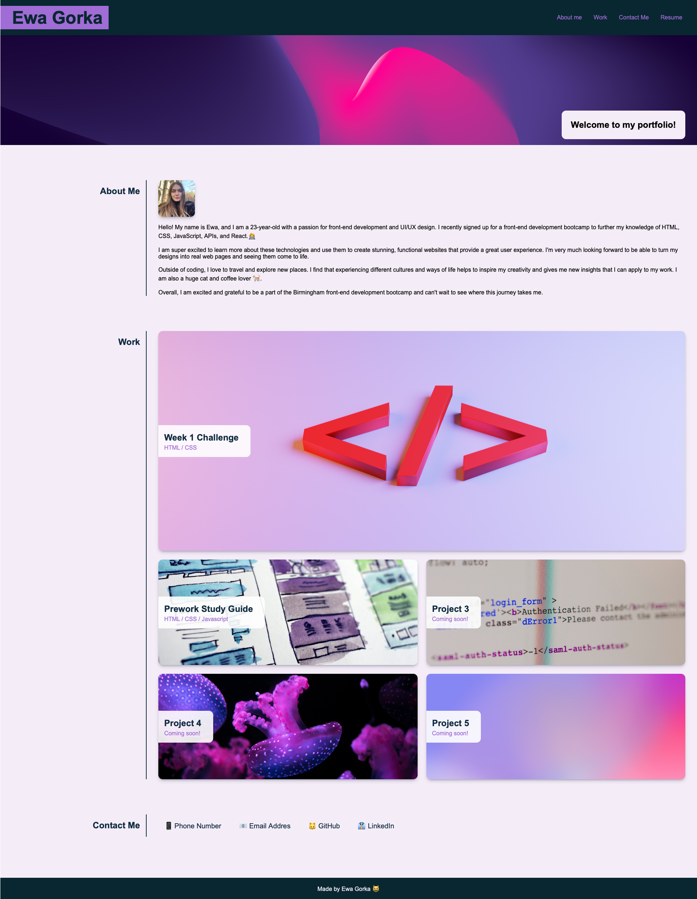

# ewagorka portfolio

## Project Description
For the second week's challenge we were asked to create a personal portfolio website, that will be responsive to various screen sizes. We were given a mock-up page that our portfolio should resemble, but were free to use our own colour scheme and images.

Apart from looking similar to the mockup picture, the portfolio page should:
* Present my name, a recent photo or avatar, and links to sections about me, me work, and how to contact me,
* When one of the links in the navigation is clicked then the UI scrolls to the corresponding section
* When viewing the section about my work then the section contains titled images of my applications
* When presented with the my first application then that application's image should be larger in size than the others
* When images of the applications are clicked then the user is taken to that deployed application
* When the page is resized or viewed on various screens and devices then the layout is responsive and adapts to my viewport

## My Approach
I approached this project by studying the mockup given, and breaking it apart into sections. This helped me structure my html file, and I could quickly move on to styling my website.

To make this portfolio resemble the given mockup I used a combination of flex and grid layouts. I chose to focus on one section at a time, style it and make sure it's responsive by using media queries before moving to the next one.

The biggest challenge for me was the work section as it involved creating nested grid layouts which were quite complicated at first. I spent a lot of time trying to make it responsive, and I am very satisfied with the end result. 

Once I had all of the elements styled and responsive I added some hover effects and linked some of my previous boot camp projects to the work section.

## Technologies
This project was made using HTML and CSS only.

## Deployed Website
You can see my deployed website here: https://ewagorka.github.io/ewagorka-portfolio/

## Deployed Website Screenshot

## License
Please refer to the LICENSE in the repo.